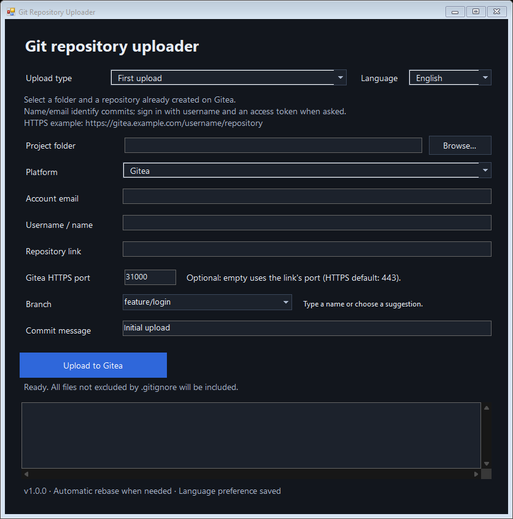
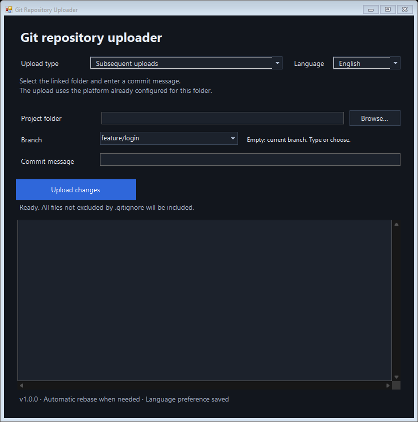
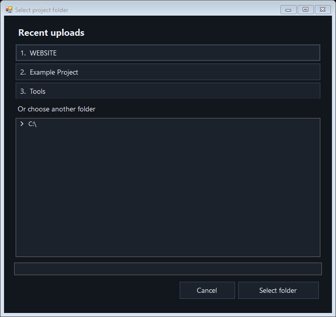

# Git Repository Uploader

A Windows desktop app for uploading a folder to **GitHub, GitLab, or Gitea**, creating commits, and publishing updates through a simple interface.

Choose an upload type, fill in the fields, and start the upload. The app runs the Git commands and displays the results in its activity log.



## Features

- **First upload:** initialize the repository, configure the commit author, connect to the service, commit, and push.
- **Automatic app updates:** quickly check GitHub at startup, download verified newer versions in the background, and install them automatically.
- **Subsequent uploads:** select a folder and enter a commit message; the app uses the existing remote connection.
- **Editable branch field:** choose `main`, the repository's default branch, or an existing branch from the suggestions, or type your own name. Existing branches are reused; missing branches are created.
- **GitHub, GitLab.com, and Gitea**, including GitLab subgroups and Gitea instances on custom HTTPS domains and ports.
- **Gitea HTTPS port field:** optionally set a port separately from the repository URL.
- **Automatic rebase** when remote changes need to be integrated.
- **English and Italian**, with the selected language remembered after closing the app.
- **Dark interface**, with readable input fields, dropdown menus, and an activity log.
- **Browse menu** with the original Windows folder dialog and quick access to your last three successfully uploaded projects.
- Respects **`.gitignore`**, includes file deletions, and preserves local commits when an upload fails.

## Requirements

- Windows 10 or Windows 11 with .NET Framework 4.8 or later.
- [Git for Windows](https://git-scm.com/download/win), with Git Credential Manager enabled for account sign-in.
- An account on the selected service and an existing repository with write permission.
- An internet connection for synchronization and uploads.

The executable requires no app installation, Python, or Node.js. Keep it in a folder you can write to so automatic updates can replace it.

## Quick start

1. Double-click **`Git Repository Uploader.exe`**.
2. Choose `English` or `Italiano` from **Language**. English is the default on first launch.
3. Choose `First upload` or `Subsequent uploads` from **Upload type**.
4. Fill in the fields and click the upload button.

In the Italian interface, the menus are labeled **Lingua**, **Tipo di caricamento**, and **Piattaforma**.

### Automatic app updates

On startup, the app checks `update.json` on the `main` branch of [the official repository](https://github.com/gabriele-gaudissard/Automatic-Github-GitLab-Uploader). The check runs in the background with a four-second deadline; the interface remains usable. If GitHub is unavailable, the file has not been published yet, or there is no newer version, you can continue using the current app.

When a newer version is available, the app downloads the executable from the same repository and verifies its SHA-256 hash, size, application identity, and version. Downloads have a separate one-minute deadline. The version and update status appear at the bottom of the window.

- If you have not started entering information or uploading a project, the app installs the update and restarts automatically.
- If you are filling in the fields or uploading, the update waits until you close the app. It then installs automatically, ready for your next launch. An active upload is never interrupted for an app update.
- Only this copy's executable is replaced. Language, recent folders, credentials managed by Git, your projects, personal files, and existing `.git` folders are preserved. Sources, documentation, and build files are available in the full distribution; the automatic runtime update only needs the executable.
- The previous executable is kept in `%LOCALAPPDATA%\GithubSetup\updates\<update-id>\previous.exe`. If installation or restarting fails, the updater attempts to restore it and leaves a `result.txt` diagnostic in that folder.

This works in both the complete folder and the public distribution, and also when someone downloads just the executable. Versions released before automatic updates were added need to be replaced manually once. Each installed copy checks and updates independently when opened.

### First upload

Create the repository on your chosen service first. An empty repository is the simplest starting point. If the remote branch already exists, the app attempts to integrate its history with a rebase.

| Field | What to enter |
| --- | --- |
| Project folder | The project's root folder, selectable with `Browse…`. |
| Platform | `GitHub`, `GitLab`, or `Gitea`. |
| Account email | The email address to associate with your commits. |
| Username / name | Your username or the commit author's name. |
| Repository link | The repository's HTTPS URL on the selected service. |
| Gitea HTTPS port | Optional, shown for Gitea only. Enter a number from `1` to `65535`, such as `31000`; leave empty to keep the URL's port, or HTTPS port `443` if none is specified. |
| Branch | Choose a suggestion, such as `main` or `Default branch`, or type a name such as `release` or `feature/login`. The first-upload default is `main`. |
| Commit message | A description of the upload; the initial value is `Initial upload`. |

Example repository links:

```text
GitHub: https://github.com/username/repository
GitLab: https://gitlab.com/username/project
GitLab with a subgroup: https://gitlab.com/group/subgroup/project
Gitea: https://gitea.com/username/repository
Gitea on your own server: https://git.example.com:3443/team/repository.git
Gitea with a URL prefix: https://git.example.com/gitea/team/repository.git
```

The `.git` suffix is optional for standard repository links. For Gitea installed under a URL prefix, copy the full HTTPS clone URL ending in `.git` from the repository's **Code** menu. Use the repository URL without page paths such as `/tree/main`, `/-/tree/main`, or `/src/branch/main`.

Click **Upload to GitHub**, **Upload to GitLab**, or **Upload to Gitea**. The app uploads to the selected branch. Name and email are configured only for the selected folder.

The **Gitea HTTPS port** field overrides any port already in the URL. For example, URL `https://git.example.com/team/repo` with port `31000` connects to `https://git.example.com:31000/team/repo.git`. This must be the server's HTTPS port, not its SSH port. The complete URL is saved in the folder's Git remote, so later uploads reuse that port automatically.

### Subsequent uploads



1. Edit your project files.
2. Select **Subsequent uploads**.
3. Select the same root folder and enter a message, such as `Fix login form`.
4. Leave **Branch** empty to keep the current branch, choose a suggestion, or type a branch name.
5. For a linked Gitea repository, optionally set **Gitea HTTPS port**, such as `31000`. The field appears after selecting the folder. Leaving it empty keeps the saved port; entering a number updates the configured fetch and push URLs.
6. Click **Upload changes**.

You do not need to enter the platform, email, or repository URL again: the app uses the branch's configured remote. If there are no new changes, it skips creating an empty commit and still attempts to synchronize and upload any unpublished local commits.

### Choosing main or your own branch (trunk)

- Click the arrow in the **Branch** field to see clickable suggestions. Choose `main`, `Default branch`, or a branch already known to the local repository. The suggestions include a known default branch even when it has a name other than `main`. Opening the suggestions does not connect to the server.
- Choose **Default branch** (**Branch principale** in Italian) to look up the remote repository's primary branch when uploading. If the server does not advertise one, including an empty repository, the app uses `main`.
- Type a name freely, such as `release`, `prova`, or `feature/login`. Numbering and a `trunk` prefix are not required. Names must follow Git's branch naming rules; spaces are not allowed.
- If the named branch exists locally, the app switches to it. If it exists on the remote, the app integrates remote changes with a rebase before pushing. If it does not exist, it is created and published on the same repository. New branches in an existing repository start from the current local history.
- Leave the field empty to keep the folder's active branch and, for subsequent uploads, its configured upstream destination. Branch choices are retained separately for the two upload modes during the current session.

Selecting a branch during subsequent uploads targets that branch on the remote configured for the branch you started from. The selected branch stays active after the upload, and its connection is remembered for later uploads. Only the selected remote branch is pushed.

Switching to an existing local branch also loads that branch's committed files. If switching would overwrite uncommitted work, the app stops and Git preserves those changes. Save or reconcile that work before retrying. Rebase conflicts also stop the upload and preserve the local commit.

## Account sign-in

The name and email fields identify the commit author. They do not sign you in to your account.

Authentication is handled by Git Credential Manager. Complete the account sign-in window when prompted. For GitHub and GitLab.com, this normally opens your browser. For GitLab.com, the app selects browser authentication, supported by the [credential manager](https://github.com/git-ecosystem/git-credential-manager/blob/main/docs/gitlab.md).

For Gitea, enter your account username in the credential manager prompt and use an access token as the password. Generate the token in your Gitea account's **Settings → Applications**, with permission to write to the repository. Gitea requires a token for Git over HTTPS when two-factor authentication is enabled; see the [Gitea authentication documentation](https://docs.gitea.com/usage/user-setting/multi-factor-authentication/). Your instance may also allow an account password when two-factor authentication is disabled.

Passwords and tokens are not stored in the app's preferences and should not be included in the repository URL. Saved credentials are managed by your configured Git credential helper. A self-hosted Gitea server must use HTTPS with a certificate trusted by Git; custom HTTPS ports and URL prefixes are supported. The app does not disable certificate verification or configure the server.

The language preference is stored at:

```text
%LOCALAPPDATA%\GithubSetup\language.txt
```

### Recent uploads

Click **Browse…** to choose between:

- **Open folder…**: opens the standard Windows Explorer folder selection dialog, with an address bar and a **Search** box to find folders quickly. Search within the current location, select the matching folder, and confirm with **Select folder**.
- **Recents**: shows your last **three distinct folders with successful uploads**, newest first. Click an entry to select that folder immediately.

In Italian, the choices are **Apri cartella…** and **Recenti**. Cancelling the Windows dialog leaves your current folder unchanged.



The list is remembered after closing the app. Uploading the same folder again moves it to the top. Failed uploads do not add folders to the list, and folders that no longer exist are hidden. Hover over a recent entry to see its full path.

Recent paths are stored only on your computer at `%LOCALAPPDATA%\GithubSetup\recent-folders.txt`. This history is not included in the app's distribution or GitHub upload package.

## Rebase and conflicts

Before pushing, the app fetches changes from the remote branch. If those changes are not already in the local history, it runs a rebase.

- **Successful rebase:** the upload proceeds.
- **Conflicts:** the app aborts the rebase, preserves the local commit, and lists the files that need manual reconciliation. The upload stops.
- **Failed push:** the commit remains saved locally, and you can retry the upload.

The app does not automatically choose which version to keep when changes conflict. After the rebase is aborted, the folder returns to its previous state and may not contain conflict markers.

## Troubleshooting

| Issue | What to do |
| --- | --- |
| Git is not found | Install Git for Windows and reopen the app. |
| The app update check is unavailable | Continue using the app. Check the internet connection; the next launch checks again. The repository must contain a matching executable and `update.json`. |
| An app update could not be installed | Keep the executable in a writable folder and close other running copies of the same executable. Check `result.txt` under `%LOCALAPPDATA%\GithubSetup\updates`. |
| The folder is not connected to a remote | Use `First upload` first. |
| A subfolder was selected | Select the root folder shown in the message. |
| Access is denied | Check your account and repository permissions, then complete sign-in. For Gitea, check that the access token can write to the repository. |
| The URL is invalid | Use the repository's HTTPS URL. GitHub and GitLab require their public domains; Gitea accepts your instance's domain. With a Gitea URL prefix, use the clone URL ending in `.git`. |
| Gitea reports a certificate error | Ask the server administrator to provide a valid HTTPS certificate and configure Git to trust the issuing certificate authority if needed. |
| The port is invalid | Enter a Gitea HTTPS port from `1` to `65535`, or leave the field empty to use the repository URL. |
| The branch name is invalid | Use a valid Git branch name, such as `release` or `feature/login`. Avoid spaces, `..`, and names beginning with `-`. |
| Git refuses to switch branches | Read the log and save or reconcile the affected local changes before retrying. |
| Rebase stopped because of conflicts | Read the file names in the log and reconcile the changes before retrying. |
| The service rejected the push | Read the Git message: the branch may be protected, your account may lack permission, or additional remote changes may have arrived. |

## Source code and building

The app is written in **C# with Windows Forms** and uses Git for Windows for repository operations.

```text
Git Repository Uploader/
├── Git Repository Uploader.exe
├── README.md
├── build.ps1
├── update.json
├── .gitignore
├── assets/
├── src/
│   ├── GitUploader.cs
│   ├── AutoUpdater.cs
│   ├── AssemblyInfo.cs
│   ├── UnifiedWindow.cs
│   ├── WindowsFolderPicker.cs
│   └── app.manifest
└── tests/
    ├── SmokeTests.cs
    └── UpdateTests.cs
```

To rebuild the app, open PowerShell in the project folder:

```powershell
powershell -NoProfile -ExecutionPolicy Bypass -File .\build.ps1
```

To build the app and run the checks:

```powershell
powershell -NoProfile -ExecutionPolicy Bypass -File .\build.ps1 -RunTests
```

### Publishing an app update

Before publishing a code change, build it with a **higher version number**:

```powershell
powershell -NoProfile -ExecutionPolicy Bypass -File .\build.ps1 -Version 1.0.1 -RunTests
```

The build updates `src/AssemblyInfo.cs`, compiles the executable, and generates `update.json` with its exact version, SHA-256 hash, and size. Upload the executable and generated metadata together, along with the shared source and documentation, to the official repository's **main** branch. No separate GitHub Release or user account sign-in is needed for update checks. An upload to a different branch does not distribute an app update.

Do not edit the executable or the generated hash by hand. Rebuilding the same version does not trigger an automatic update: increase the version for each public app change. If you maintain a fork, change the repository constants in `src/AutoUpdater.cs` before building so your app checks your own repository.

The checks use local test repositories without publishing files to hosted services. They cover first uploads, updates, deletions, `.gitignore`, rebase, commit preservation after conflicts, freely named branches, default-branch discovery, editable suggestions, safe branch switching, retry after failed pushes, Gitea ports, both interface languages, and saved preferences and recent folders. App-update tests simulate GitHub responses and run a real updater helper against temporary executables, checking version comparison, integrity verification, cancellation, offline behavior, backup creation, and preservation of personal files and Git metadata. Live authentication and server-specific policies require an account on the chosen service. Test folders are created under `work/`, which is excluded from version control.

## Scope of this version

The first-upload menu supports HTTPS repositories on **github.com**, **gitlab.com**, and **Gitea instances on public or private hosts**. HTTP and SSH links are not accepted for first uploads. Subsequent uploads use the folder's existing Git remote. The app does not create remote repositories, manage merge requests or pull requests, or resolve conflicts for you. Service rules, including branch protection, still apply.
